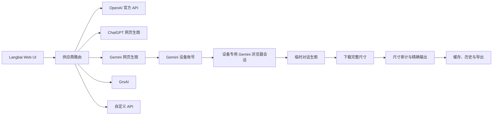

# Langbai Image Studio v1.6.0：Gemini 网页生图接入与图片尺寸专门设计报告

> 基线仓库：`F:\AI\agent\codex\Langbai-api-image-Studio-v145-publish`
> 基线版本：`1.5.4+76`
> 基线提交：`a49f613`（与 `origin/main` 一致）
> 目标版本：`1.6.0+77`
> 报告状态：实施设计，尚未改动业务源码

---

## 1. 报告修订说明

旧报告基于 `Langbai-api-image-Studio` 的 v1.4.5 结构，缺少 v1.5.4 已经加入的以下能力：

- Windows 内置 ChatGPT 网页生图网关；
- Android App 内置 ChatGPT 网页生图网关；
- ChatGPT 多账号、安全存储与账号自动切换；
- Windows 隐藏网关进程、随机端口和随机运行密钥；
- Android 进程内本机服务；
- 异步任务续传和任务级账号绑定；
- 参考图、局部重绘、尺寸审计和精确输出；
- 官方 OpenAI 图片费用估算；
- v1.5.4 的五语言界面及新版更新链路。

本报告以 v1.5.4+76 为唯一实施基线。Gemini 网页生图作为新增供应商接入，不复用 ChatGPT 的供应商 ID，不迁移 ChatGPT 账号，不删除官方 OpenAI、ChatGPT 网页生图、GrsAI 或自定义 API。

---

## 2. 执行结论

v1.6.0 采用“**独立 Gemini 网页账号 + 独立本机生图适配器 + 共享任务和尺寸层**”：



核心决策：

1. 新供应商 ID 固定为 `geminiWeb`。
2. ChatGPT 继续使用现有 `codexImageGateway`，保持现有项目和账号数据兼容。
3. Gemini 账号与 ChatGPT 账号分库存储、分开切换、分开统计限流。
4. 每台设备通过受支持的系统浏览器登录自己的 Gemini 网页账号，账号状态只留在该设备。
5. 每个生图任务固定使用 Gemini 临时对话，并验证任务前后历史列表保持一致。
6. 每个上游任务固定生成一张图片；批量数量由 Langbai 队列拆分。
7. 网页下载优先选择“下载完整尺寸”，预览图只用于界面占位。
8. 当前本机实测把网页原生能力标为 2K；4K 入口明确标记为“2K 原图 + 本地高质量放大”。
9. 精确像素由本地尺寸处理器保证，并在结果卡记录裁切、缩放和最终尺寸。
10. Gemini 网页 DOM 和网络协议独立封装，网页改版时只更新适配层。

---

## 3. 已确认事实、合理推测与待验证项

### 3.1 已确认的 v1.5.4 事实

源码核对结果：

| 项目 | v1.5.4 现状 |
|---|---|
| 软件版本 | `1.5.4+76` |
| 现有供应商 | `official`、`codexImageGateway`、`grsai`、`custom` |
| Windows ChatGPT 网关 | 已内置，动态监听 `127.0.0.1:18081–18100` |
| Android ChatGPT 网关 | 已内置，App 进程内启动 |
| ChatGPT 多账号 | 已实现 |
| 安全存储 | 已实现，使用 `flutter_secure_storage` |
| 异步任务 | 已实现 |
| 参考图 | ChatGPT 路线最多 20 张 |
| 尺寸模式 | 原生、严格原生、精确输出 |
| 自定义尺寸 | UI 范围 `64–4096` |
| 多语言 | 简中、繁中、英语、日语、韩语 |

### 3.2 已确认的 Gemini 本机实测

| 测试项 | 结果 |
|---|---|
| 账号 | Google AI Pro 网页账号 |
| 模式 | Gemini 临时对话 |
| 1:1 完整尺寸 | `2048×2048` |
| 3:2 横图完整尺寸 | `2528×1696` |
| 3:2 请求 4K | 完整尺寸仍为 `2528×1696` |
| 预览图 | 可能低于完整下载尺寸 |
| 临时对话历史检查 | 测试前后历史数量及摘要一致 |
| 3:2 单张测试耗时 | 约 48 秒，属于一次本机样本 |

以上结果只代表测试时的账号、地区、网页版本和服务状态。软件需把能力探测结果写入本机缓存，而不是把该尺寸视为永久协议。

### 3.3 合理推测

- Gemini 网页对“尺寸”的理解以比例和分辨率档位为主，任意像素值更多属于提示意图。
- 网页预览资源和“下载完整尺寸”资源是两条资源链。
- Pro、Fast 或未来新增档位的输出尺寸、排队和限流策略可能不同。
- 多任务并发受账号额度、浏览器页签数量、地区负载和网页策略共同影响。

### 3.4 v1.6.0 上线前待验证

- Windows 隐藏工作页在连续 10 个任务下的稳定性；
- Android 系统浏览器伴侣中的 Gemini 登录、临时对话和完整尺寸下载；
- macOS Safari/Chrome 伴侣的登录链路；
- iOS Safari Web Extension、前台限制和文件下载；
- 1:1 与 3:2 之外各比例的真实完整尺寸；
- 参考图上传数量上限；
- Gemini 网页是否提供稳定的编辑或蒙版入口；
- “扩展思考”对生图结果、速度与尺寸的真实影响。

---

## 4. 对 v1.5.4 的兼容原则

### 4.1 保留现有功能

- OpenAI 官方 API；
- ChatGPT 网页生图；
- GrsAI；
- 自定义 API；
- ChatGPT 多账号；
- 漫画分镜；
- 单图模式；
- 嵌字模式；
- 历史、缓存、ZIP 和目录导出；
- 参考图和局部重绘；
- 软件更新；
- 五语言和双主题。

### 4.2 数据隔离

新增配置键统一使用 `geminiWeb.*` 前缀：

```text
geminiWeb.provider
geminiWeb.accountMetadata
geminiWeb.activeAccountId
geminiWeb.queueLimit
geminiWeb.effectiveConcurrency
geminiWeb.sizeMode
geminiWeb.nativePreset
geminiWeb.browserProfileVersion
geminiWeb.selectorPackVersion
```

以下现有键维持原样：

```text
codexImageGateway.*
chatGptAccounts.*
officialImageOptions.*
grsai.*
custom.*
```

### 4.3 版本迁移

v1.5.4 升级到 v1.6.0 时只新增 Gemini 默认配置：

```json
{
  "provider": "geminiWeb",
  "enabled": false,
  "queueLimit": 10,
  "effectiveConcurrency": 1,
  "sizeMode": "native_fullsize",
  "nativePreset": "auto",
  "temporaryChatRequired": true
}
```

升级过程保留当前供应商选择。用户首次完成 Gemini 登录并通过能力检测后，才显示“设为当前供应商”操作。

---

## 5. v1.6.0 总体架构

### 5.1 三层结构

#### 共享产品层

继续使用：

- `index.html`
- `app.js`
- `style.css`
- `image-task-stability.js`

新增 Gemini 供应商卡片、账号卡片、能力显示、尺寸模式和诊断信息。

#### 共享 Flutter 层

新增：

- Gemini 账号元数据模型；
- Gemini 安全存储；
- Gemini 本机网关生命周期接口；
- Gemini 状态事件；
- Gemini 平台能力接口。

#### 平台宿主层

各平台负责：

- 打开真实 Gemini 登录页面；
- 保存设备专用浏览器会话；
- 创建临时对话工作页；
- 提交提示词与参考图；
- 等待生成完成；
- 获取完整尺寸图片；
- 把图片字节和非敏感审计信息返回共享层。

### 5.2 供应商路由

`index.html` 增加：

```html
<option value="geminiWeb" data-native-gateway-only="true">
  Gemini 网页生图
</option>
```

`app.js` 增加：

```js
const GEMINI_WEB_PROVIDER = "geminiWeb";
```

供应商选择规则：

| 供应商 | 账号来源 | 请求协议 | 任务命名空间 |
|---|---|---|---|
| OpenAI 官方 | API Key | Image API | `official:*` |
| ChatGPT 网页 | ChatGPT Session | 现有内置网关 | `chatgpt:*` |
| Gemini 网页 | Gemini 浏览器会话 | 新平台适配器 | `gemini:*` |
| GrsAI | GrsAI Key | generate/result | `grsai:*` |
| 自定义 | 自定义 Key | OpenAI 兼容 | `custom:*` |

---

## 6. 建议新增文件

### 6.1 Web 层

| 文件 | 作用 |
|---|---|
| `gemini-web-image-adapter.js` | 请求构建、能力校验、任务响应标准化 |
| `gemini-image-size-registry.js` | 比例、网页原生尺寸和目标尺寸映射 |
| `gemini-selector-pack.js` | 多语言 DOM 特征与版本化选择器 |

### 6.2 Flutter 公共层

| 文件 | 作用 |
|---|---|
| `lib/gemini_account_store.dart` | 账号元数据和安全存储 |
| `lib/gemini_web_gateway.dart` | 统一浏览器伴侣接口和状态模型 |
| `lib/gemini_image_task.dart` | 任务模型、恢复和错误映射 |
| `lib/gemini_size_capabilities.dart` | 本机探测缓存和尺寸能力 |

### 6.3 平台层

| 平台 | 建议文件 |
|---|---|
| Windows | `lib/windows_gemini_web_gateway.dart`、`windows/runner/gemini_browser_companion.*` |
| Android | `lib/android_gemini_web_gateway.dart`、`MainActivity.kt` 与浏览器伴侣扩展 |
| macOS | `lib/macos_gemini_web_gateway.dart`、`macos/Runner/GeminiBrowserCompanion.swift` |
| iOS | `lib/ios_gemini_web_gateway.dart`、`ios/Runner/GeminiSafariExtension.swift` |

### 6.4 测试

| 文件 | 作用 |
|---|---|
| `test/gemini_size_registry_test.dart` | 比例选择和精确尺寸 |
| `test/gemini_account_store_test.dart` | 账号隔离和迁移 |
| `test/gemini_task_state_test.dart` | 任务状态、恢复和幂等 |
| `qa/gemini-web-regression.js` | 登录后端到端回归 |
| `qa/gemini-size-matrix.js` | 完整尺寸探测矩阵 |

---

## 7. Gemini 登录与设备账号

### 7.0 登录架构修正

Google OAuth 政策明确要求开发者不要把 OAuth 授权请求导向由开发者控制的嵌入式用户代理。因此，v1.6.0 不把 Google 登录页放进可注入脚本、读取 Cookie 的 Flutter WebView。

采用以下边界：

- 登录发生在用户设备的受支持系统浏览器；
- Langbai 通过浏览器伴侣与 `gemini.google.com` 当前页面协作；
- 伴侣只接收图片任务和返回图片结果；
- Cookie 和 Google 登录凭据留在浏览器存储；
- Langbai 安全存储只保存本机配对密钥、脱敏账号元数据和任务状态；
- 自动化脚本只在 `https://gemini.google.com/*` 生效。

这一修订增加浏览器伴侣组件，但符合系统浏览器登录边界，也降低了把 Google 账号会话复制进本地网关的风险。

### 7.1 用户流程

1. 选择“Gemini 网页生图”。
2. 点击“登录 Gemini”。
3. 软件打开系统浏览器中的 Gemini 页面。
4. 用户在 Google 页面完成登录、验证和账号选择。
5. 用户确认启用 Langbai Gemini 浏览器伴侣。
6. 伴侣与 Langbai 本机桥完成一次随机码配对。
7. 软件检查 Gemini 生图入口、临时对话和完整尺寸下载。
8. 软件新建临时对话并执行 UI 能力探测。
9. 状态显示“登录有效”。
10. 后续启动复用该设备的系统浏览器会话。

### 7.2 账号隔离

每个账号使用独立本机 ID：

```json
{
  "local_account_id": "UUID",
  "display_name": "Gemini 账号",
  "masked_email": "a***@example.com",
  "platform": "windows",
  "profile_version": 1,
  "status": "ready",
  "last_verified_at": "ISO-8601",
  "last_capability_probe_at": "ISO-8601"
}
```

项目文件、历史、日志和导出 ZIP 只记录本地账号 ID 后四位，不记录 Cookie、Token、登录页内容或完整邮箱。

### 7.3 安全存储

| 平台 | 存储 |
|---|---|
| Windows | Credential Manager / DPAPI + 浏览器扩展本机配对 |
| Android | Keystore + 支持扩展的系统浏览器配对 |
| macOS | Keychain + Safari/Chrome 伴侣配对 |
| iOS | Keychain + Safari Web Extension 配对 |

浏览器会话由系统浏览器保存；Web SPA 的 LocalStorage 只接收脱敏状态。

### 7.4 平台登录风险

Google 对嵌入式登录环境具有明确限制。v1.6.0 应执行真机门禁：

- Windows：Edge/Chrome 扩展 + Native Messaging 或本机回环配对；
- Android：优先支持扩展的系统浏览器；浏览器缺少伴侣能力时入口显示平台诊断；
- macOS：Safari Web Extension 与 Chrome/Edge 扩展二选一；
- iOS：Safari Web Extension；GitHub 发布包仍需用户侧签名或侧载流程。

平台入口只在“登录 + 临时对话 + 完整尺寸下载”三项测试通过后启用。

---

## 8. 临时对话专门设计

### 8.1 目标

每张图片使用独立临时对话，任务完成后历史列表数量和摘要保持一致。软件后台仍会创建一段临时服务会话，但它不进入普通历史列表。Google 官方帮助还说明，临时对话可能与账号关联保留最多 72 小时，用于响应请求和保护服务。

### 8.2 提交前门禁

每个工作页必须依次确认：

```text
gemini_page_ready
account_ready
image_model_available
temporary_chat_active
composer_ready
```

任一状态缺失时，任务停留在 `waiting_for_browser`，不提交提示词。

### 8.3 临时对话识别

采用“语义特征 + ARIA + 文本候选 + URL 状态”四层识别，避免只依赖单个 CSS 类名。

选择器包结构：

```json
{
  "version": "2026.07.29.1",
  "temporary_chat": {
    "aria_labels": ["Temporary chat", "临时对话"],
    "text_candidates": ["Temporary", "临时"],
    "required_state": "active"
  },
  "image_action": {
    "aria_labels": ["Create image", "生成图片"]
  },
  "download_full_size": {
    "text_candidates": ["Download full size", "下载完整尺寸"]
  }
}
```

### 8.4 历史污染检测

每批任务前后记录：

```json
{
  "history_count_before": 52,
  "history_count_after": 52,
  "history_digest_before": "SHA-256",
  "history_digest_after": "SHA-256",
  "temporary_chat_verified": true
}
```

检测到历史变化时：

1. 暂停新任务；
2. 保留已提交任务轮询；
3. 标记 `temporary_chat_guard_failed`；
4. 显示选择器包版本和本次诊断摘要；
5. 等待适配器更新或用户重新登录。

---

## 9. 生图任务协议

### 9.1 统一任务请求

```json
{
  "provider": "geminiWeb",
  "client_request_id": "UUID",
  "account_id": "LOCAL_ACCOUNT_ID",
  "prompt": "图片提示词",
  "references": [],
  "requested_size": {
    "width": 832,
    "height": 1216
  },
  "requested_ratio": "2:3",
  "size_mode": "exact_output",
  "resolution_intent": "2k",
  "quality_intent": "detail",
  "temporary_chat_required": true
}
```

### 9.2 状态机

```text
draft
queued
waiting_for_browser
preparing_temporary_chat
uploading_references
submitting
generating
locating_full_size
downloading
verifying
post_processing
succeeded
failed
needs_login
paused_by_rate_limit
protocol_changed
```

### 9.3 幂等规则

- 每个请求先生成 `client_request_id`。
- 同一 ID 在本地任务库只存在一条。
- 提示词已经进入网页且提交结果未知时，先定位当前临时任务状态。
- 页面显示生成成功后，下载或保存失败只重试下载和保存。
- 审核拦截、提示词错误和参考图格式错误不自动重交。
- 网页刷新前保存当前阶段、工作页 ID、图片节点摘要和下载状态。

### 9.4 任务恢复

软件重启后：

1. 恢复 Gemini 系统浏览器会话与伴侣配对；
2. 校验账号；
3. 读取未完成任务；
4. 定位仍存活的临时工作页；
5. 已有完整图片节点时直接下载；
6. 已有下载缓存时继续校验和保存；
7. 上游状态不明确时标记“待人工确认”，避免重复消耗额度。

---

## 10. 并发与批量分镜

### 10.1 用户设置

- 可输入范围：`1–100`；
- 默认输入：`10`；
- 单个上游任务固定一张；
- “依次生成”开启时有效并发为 `1`；
- UI 同时显示用户并发和当前有效并发。

### 10.2 初始策略

本地设置值代表队列上限，不代表网页端承诺同等吞吐。首次登录后的初始有效并发：

| 平台 | 初始有效并发 | 稳定后上限建议 |
|---|---:|---:|
| Windows | 3 | 10 |
| Android | 2 | 5 |
| macOS | 2 | 8 |
| iOS | 1 | 3 |

用户仍可输入 1–100，调度器根据成功率逐步接近用户设置值。

### 10.3 自适应调度

| 事件 | 动作 |
|---|---|
| 连续 5 个成功 | 有效并发增加 1 |
| 单次限流 | 有效并发减半 |
| 连续服务繁忙 | 暂停新提交，继续下载现有结果 |
| 登录失效 | 账号队列转为 `needs_login` |
| 页面内存过高 | 回收空闲工作页并减少 1 个并发 |
| 下载变慢 | 生成槽与下载槽分离 |
| 协议变化 | 触发供应商级熔断 |

### 10.4 工作页池

一个账号维护：

```text
1 个控制页
N 个临时对话工作页
2 个下载槽
1 个历史守卫
```

每个工作页一次只处理一张图片。生成完成后清理页面状态，再进入下一任务。浏览器伴侣通过扩展后台脚本管理工作页，Langbai 主界面不直接读取页面 Cookie。

---

## 11. 图片尺寸专门设计

### 11.1 设计目标

尺寸系统必须分别表达：

1. 用户希望的最终像素；
2. 提交给 Gemini 的比例与分辨率意图；
3. 网页下载的真实完整尺寸；
4. 本地处理后的最终尺寸；
5. 裁切、缩放、填充或放大的审计记录。

界面不把“最终精确尺寸”描述为“Gemini 原生精确尺寸”。

### 11.2 四种尺寸模式

#### A. 网页原生完整尺寸 `native_fullsize`

- 选择最接近的 Gemini 比例；
- 请求 2K；
- 点击“下载完整尺寸”；
- 保存下载到的真实像素；
- 不裁切、不缩放；
- 结果卡显示请求目标和网页实际尺寸。

适合保存网页原始输出。

#### B. 严格原生 `strict_native`

- 下载完整尺寸；
- 实际宽高与目标宽高逐像素比较；
- 完全一致时进入正式结果；
- 存在差异时进入尺寸隔离区；
- 原图保持原样。

适合测量 Gemini 网页的真实能力。

#### C. 精确输出 `exact_output`

- 先下载网页完整尺寸；
- 选择覆盖裁切或包含适配；
- 使用 Lanczos 缩放；
- 最终文件精确命中目标像素；
- 元数据记录为本地后处理。

适合 `832×1216`、`1216×832`、漫画分镜和视频画面。

#### D. 本地 4K `local_4k_upscale`

- 先请求 Gemini 2K；
- 下载完整尺寸；
- 先处理目标比例；
- 使用高质量本地放大到 4K；
- 可选轻度锐化和噪点保护；
- 结果卡标记“网页 2K + 本地 4K”。

当前实测中，3:2 请求 4K 仍返回 `2528×1696`，因此这一模式不标记为网页原生 4K。

### 11.3 网页原生能力注册表

初始只写入已实测项：

```json
{
  "provider": "geminiWeb",
  "probe_version": 1,
  "presets": [
    {
      "ratio": "1:1",
      "resolution": "2k",
      "observed_width": 2048,
      "observed_height": 2048,
      "status": "verified"
    },
    {
      "ratio": "3:2",
      "resolution": "2k",
      "observed_width": 2528,
      "observed_height": 1696,
      "status": "verified"
    }
  ]
}
```

其他比例第一次使用前执行探测或标记为 `unverified`，生成后用真实尺寸更新本机注册表。

### 11.4 目标尺寸映射

| 用户目标 | 目标比例 | Gemini 请求意图 | 建议模式 |
|---|---:|---|---|
| `832×1216` | 约 2:3 | 2:3、2K、竖图 | 精确输出 |
| `1216×832` | 约 3:2 | 3:2、2K、横图 | 精确输出 |
| `1024×1024` | 1:1 | 1:1、2K | 精确输出或原生 |
| `2048×2048` | 1:1 | 1:1、2K | 严格原生 |
| `1536×1024` | 3:2 | 3:2、2K | 精确输出 |
| `1024×1536` | 2:3 | 2:3、2K | 精确输出 |
| `1920×1080` | 16:9 | 16:9、2K | 精确输出 |
| `1080×1920` | 9:16 | 9:16、2K | 精确输出 |
| `2560×1440` | 16:9 | 16:9、2K | 精确输出 |
| `3840×2160` | 16:9 | 16:9、2K | 本地 4K |
| `2160×3840` | 9:16 | 9:16、2K | 本地 4K |

### 11.5 比例选择算法

目标比例：

```text
target_ratio = target_width / target_height
```

候选比例距离：

```text
distance = abs(log(target_ratio / candidate_ratio))
```

选择距离最小的候选比例。使用对数距离可让横竖方向保持对称。

候选比例建议：

```text
1:1
3:2
2:3
4:3
3:4
16:9
9:16
```

最终候选集以运行时页面实际显示为准。

### 11.6 精确输出算法

#### 覆盖裁切

适用于全画幅且允许裁边：

```text
scale = max(target_width / source_width,
            target_height / source_height)

scaled_width  = round(source_width  * scale)
scaled_height = round(source_height * scale)
```

缩放后从安全中心裁出目标尺寸。

#### 包含适配

适用于角色全身、产品和文字排版：

```text
scale = min(target_width / source_width,
            target_height / source_height)
```

剩余区域使用：

- 纯色；
- 模糊延展；
- 镜像延展；
- 用户指定背景色。

#### 智能安全裁切

默认中心由以下信息调整：

1. 人脸框；
2. 主体显著区域；
3. 文字框；
4. 用户在参考图中设置的关注点；
5. 漫画气泡预留区。

裁切优先级：

```text
文字完整 > 人脸完整 > 主体完整 > 中心构图
```

### 11.7 尺寸提示词

提示词只负责构图，不负责最终像素保证。自动前缀示例：

```text
横向 3:2 构图，主体位于画面中央安全区，四周保留 8% 可裁切空间，
按 2K 细节绘制；最终目标输出为 1536×1024。
```

竖向漫画示例：

```text
竖向 2:3 漫画分镜，人物全身保持在中央 84% 安全区，
顶部和底部保留裁切余量；最终目标输出为 832×1216。
```

### 11.8 尺寸审计

每张图片保存：

```json
{
  "requested": "832x1216",
  "requested_ratio": "2:3",
  "web_resolution_intent": "2k",
  "downloaded_fullsize": "1696x2528",
  "final": "832x1216",
  "mode": "exact_output",
  "transform": "smart_cover_crop+lanczos",
  "crop_rect": [0, 24, 1696, 2479],
  "native_sha256": "HASH",
  "final_sha256": "HASH"
}
```

结果卡显示：

```text
目标：832×1216
Gemini 完整尺寸：1696×2528
最终：832×1216
处理：智能覆盖裁切 + Lanczos
```

### 11.9 图片底边与异常画布检查

保存前自动检测：

- 底部半透明条；
- 单色边框；
- 画布尺寸与有效图像区域不一致；
- EXIF 旋转导致横竖颠倒；
- 预览截图误当完整图片；
- 下载到 HTML 或错误页；
- Alpha 通道异常；
- 图片只完成部分解码。

检测到边缘异常时保留原图并生成诊断副本，结果进入“画布异常”分组。

---

## 12. 质量档位设计

Gemini 网页供应商使用“质量意图”，与 OpenAI 官方 API 的 `low/medium/high` 参数分开：

| UI 名称 | 内部值 | 行为 |
|---|---|---|
| 快速 | `fast` | 简化提示增强，优先较短任务 |
| 标准 | `standard` | 默认批量分镜 |
| 细节优先 | `detail` | 加入高细节构图要求，可选择 Pro |

界面说明：

> 该设置是 Gemini 网页生成意图。实际模型、采样和压缩由网页服务决定。

“扩展思考”单独作为实验开关：

```text
extended_thinking = off | on
```

只有 A/B 测试证明它对生图结果产生稳定影响后，才进入默认配置。

---

## 13. 参考图与局部重绘

### 13.1 v1.6.0 首版策略

- 先完成文生图；
- 再验证单张参考图；
- 逐步测试 2、5、10、20 张；
- 页面实际接受数量写入能力接口；
- 上传任一参考图失败时终止该任务；
- 不退化为纯文生图。

### 13.2 参考图请求

参考图按用户顺序编号：

```text
参考图 1：角色正面
参考图 2：角色侧面
参考图 3：服装
参考图 4：场景
```

当页面多图入口限制数量时，软件生成带编号的参考图板，并保留原图哈希和拼板坐标。

### 13.3 局部重绘

Gemini 网页首版使用“语义重绘 + 本地蒙版合成”：

1. 上传原图；
2. 上传或描述修改区域；
3. 生成候选图；
4. 本地对齐候选图；
5. 只在蒙版区域合成；
6. 蒙版外像素使用原图；
7. 记录候选图和合成审计。

在网页原生 mask 协议完成实测前，界面使用“语义局部重绘”名称。

---

## 14. 平台实施方案

### 14.1 Windows

复用 v1.5.4 的：

- 隐藏辅助进程模式；
- 动态本机端口；
- 随机运行密钥；
- 主进程退出联动；
- 安装器打包和静默更新。

新增浏览器伴侣配对目录：

```text
%LOCALAPPDATA%\AI Image Generator\gemini_companion\<ACCOUNT_ID>\
```

ChatGPT 继续使用现有内置网关；Gemini 使用系统浏览器会话与独立本机配对密钥。

### 14.2 Android

复用 v1.5.4 的：

- Android 原生桥；
- App 进程内任务网关；
- Keystore 安全存储；
- SAF 下载和目录授权。

新增 Gemini 浏览器伴侣配对、任务桥、工作页池状态和图片完整下载桥。Android 浏览器能力差异较大，发布页需列出已验证浏览器版本。

### 14.3 macOS

v1.5.4 仅构建 macOS 壳，尚未包含 ChatGPT 内置网关。Gemini 接入需新增：

- Safari Web Extension 或 Chrome/Edge 扩展；
- Keychain；
- 隐藏工作页生命周期；
- 下载完整尺寸桥；
- 沙盒网络和文件权限；
- 签名与公证说明。

### 14.4 iOS

新增：

- Safari Web Extension；
- Keychain；
- 前台任务队列；
- 图片写入和相册权限；
- App 切后台后的任务暂停与恢复；
- GitHub 侧载包说明。

iOS 的网页账号登录和后台执行限制较多，正式入口需经过真机门禁。

---

## 15. 本机网关接口

与 ChatGPT 网关分开运行，建议接口：

### 健康检查

```http
GET /healthz
Authorization: Bearer <RUNTIME_KEY>
```

```json
{
  "status": "ok",
  "provider": "gemini_web",
  "version": "1.6.0",
  "session_available": true,
  "temporary_chat_available": true,
  "fullsize_download_available": true
}
```

### 能力

```http
GET /v1/capabilities
```

```json
{
  "image_only": true,
  "max_batch_input": 100,
  "max_effective_concurrency": 10,
  "temporary_chat_required": true,
  "reference_images": {
    "verified_max": 1,
    "client_limit": 20
  },
  "resolution_intents": ["2k"],
  "dimension_modes": [
    "native_fullsize",
    "strict_native",
    "exact_output",
    "local_4k_upscale"
  ],
  "verified_native_presets": [
    "2048x2048",
    "2528x1696"
  ]
}
```

### 提交

```http
POST /v1/images/tasks
Content-Type: application/json
```

### 查询

```http
GET /v1/images/tasks/{task_id}
```

### 下载

```http
GET /v1/images/tasks/{task_id}/image
```

网关只监听 `127.0.0.1`，使用每次启动随机密钥，文字对话路由返回 `404`。

---

## 16. 错误分类

| 错误码 | 含义 | 调度动作 |
|---|---|---|
| `gemini_login_required` | 登录状态缺失或过期 | 暂停该账号队列 |
| `gemini_rate_limited` | 账号额度或速率限制 | 降低并发并冷却 |
| `gemini_service_busy` | 网页服务繁忙 | 延迟新任务 |
| `temporary_chat_guard_failed` | 临时对话守卫失败 | 供应商熔断 |
| `selector_pack_outdated` | 页面结构与选择器包不匹配 | 提示更新适配器 |
| `image_action_missing` | 生图入口未识别 | 保存诊断摘要 |
| `reference_upload_failed` | 参考图上传失败 | 终止当前任务 |
| `moderation_blocked` | 内容审核拦截 | 展示 Request ID |
| `fullsize_download_missing` | 未定位完整尺寸下载 | 保留页面和任务 |
| `preview_only_detected` | 仅取得预览资源 | 继续定位完整资源 |
| `image_decode_failed` | 图片字节校验失败 | 只重试下载 |
| `dimension_mismatch` | 严格原生尺寸不一致 | 隔离导出 |
| `save_failed` | 图片生成完成，本地保存失败 | 只重试保存 |
| `protocol_changed` | 网页流程发生变化 | 暂停 Gemini 供应商 |

错误信息必须区分：

- 上游尚未生成；
- 上游已经生成、正在下载；
- 下载完成、正在校验；
- 图片已完成、本地保存异常。

---

## 17. UI 专门设计

### 17.1 供应商卡片

```text
Gemini 网页生图
使用当前设备登录的 Gemini 网页账号
临时对话 · 完整尺寸下载 · 本地尺寸适配
```

### 17.2 账号卡片

显示：

- 脱敏账号；
- 登录状态；
- 最近验证时间；
- 临时对话状态；
- 网页生图入口状态；
- 当前有效并发；
- 冷却时间；
- 重新登录；
- 切换账号；
- 删除本机账号。

### 17.3 尺寸卡片

第一行：

```text
网页原生完整尺寸
严格原生
精确输出
本地 4K
```

第二行：

```text
比例：自动 / 1:1 / 3:2 / 2:3 / 4:3 / 3:4 / 16:9 / 9:16
```

第三行：

```text
目标尺寸：常用预设 / 自定义
```

第四行：

```text
裁切策略：智能安全裁切 / 居中裁切 / 包含适配
```

### 17.4 实时状态

```text
用户并发：10
当前有效：4
生成中：4
下载中：2
排队：16
网页状态：正常
历史守卫：通过
```

---

## 18. 实施顺序

### 阶段 A：基线保护

1. 备份当前未提交文件；
2. 从 `origin/main` 创建 `codex/gemini-web-image-v160`；
3. 记录基线 `a49f613`；
4. 固定目标版本 `1.6.0+77`；
5. 建立 v1.5.4 全量回归基线。

### 阶段 B：共享供应商和尺寸层

1. 添加 `geminiWeb`；
2. 添加独立配置和多语言文案；
3. 添加尺寸注册表；
4. 添加精确输出审计；
5. 添加任务状态和错误码；
6. 更新浏览器回归。

### 阶段 C：Windows

1. 独立 Gemini 浏览器伴侣配对；
2. 系统浏览器登录检测；
3. 临时对话守卫；
4. 单张文生图；
5. 完整尺寸下载；
6. 3:2、1:1 和精确尺寸；
7. 10 任务并发；
8. 隐藏进程与安装器。

### 阶段 D：Android

1. Gemini 浏览器伴侣；
2. 系统浏览器登录和配对；
3. 临时对话；
4. 完整尺寸下载；
5. App 重启恢复；
6. 参考图；
7. APK 正式签名回归。

### 阶段 E：macOS 与 iOS

1. 平台 Web 宿主；
2. 安全存储；
3. 登录门禁；
4. 临时对话门禁；
5. 完整尺寸门禁；
6. 文件导出；
7. GitHub 发布包。

### 阶段 F：参考图和重绘

1. 1 张参考图；
2. 多参考图能力探测；
3. 参考图拼板；
4. 语义局部重绘；
5. 本地蒙版合成；
6. 20 张客户端输入回归。

---

## 19. 测试矩阵

### 19.1 v1.5.4 回归

- OpenAI 官方 API；
- ChatGPT Windows；
- ChatGPT Android；
- ChatGPT 多账号切换；
- GrsAI；
- 自定义 API；
- 漫画项目；
- 参考图；
- 局部重绘；
- 历史和 ZIP；
- Windows 静默更新；
- Android 签名。

### 19.2 Gemini 登录

- 单账号；
- 账号切换；
- 软件重启恢复；
- 登录过期；
- Google 验证页面；
- Pro 套餐；
- 生图入口缺失；
- 临时对话按钮改名；
- 页面语言为中、英、日。

### 19.3 Gemini 生图

- 单张；
- 10 张批量；
- 并发 1、3、5、10；
- 限流降速；
- 网页服务繁忙；
- 生成完成后下载中断；
- 下载完成后保存失败；
- 软件重启后继续；
- 审核拦截；
- 选择器版本失配。

### 19.4 尺寸

- `2048×2048` 严格原生；
- 3:2 完整尺寸；
- `832×1216` 精确输出；
- `1216×832` 精确输出；
- `1536×1024` 精确输出；
- `1920×1080` 精确输出；
- `3840×2160` 本地 4K；
- 横竖方向校验；
- EXIF 旋转；
- 智能裁切；
- 包含适配；
- 底部边条检测；
- 预览图误识别拦截。

### 19.5 临时对话

- 单任务前后历史一致；
- 10 任务前后历史一致；
- 软件重启后历史一致；
- 切换账号后历史分别一致；
- 临时对话守卫失效时停止新提交。

### 19.6 安全

- LocalStorage 中无 Gemini Cookie 或 Token；
- 日志中无认证头；
- 项目和 ZIP 中无账号凭据；
- 网关只监听本机；
- 随机密钥错误时返回 401；
- 删除账号后清理对应本机 Profile；
- 崩溃报告只保留脱敏诊断；
- GitHub 构建产物中无本机凭据。

---

## 20. 发布与 CI

### 20.1 版本

```yaml
version: 1.6.0+77
```

### 20.2 GitHub 发布物

- Windows 安装包；
- Windows Gemini 浏览器伴侣扩展包与一次性启用向导；
- Android 正式签名 APK；
- Android 已验证浏览器与伴侣扩展清单；
- macOS 包；
- macOS 内含 Safari Web Extension；
- iOS 未签名包；
- iOS 内含 Safari Web Extension；
- `SHA256SUMS.txt`；
- `RELEASE_REPORT_v1.6.0.md`；
- Gemini 平台能力表；
- 已知问题清单。

### 20.3 CI 门禁

1. Flutter Analyze；
2. Flutter 单元测试；
3. 浏览器全量回归；
4. Windows 打包和安装冒烟；
5. Windows 网关隐藏启动；
6. Android APK 构建和签名核对；
7. macOS 构建；
8. iOS 构建；
9. 资源同步校验；
10. 凭据扫描；
11. 版本一致性检查；
12. SHA-256 生成。

网页账号端到端测试使用人工登录的本机测试环境；GitHub Actions 不保存 Gemini 账号会话。

GitHub-only 分发意味着 Chromium 系浏览器伴侣可能需要用户首次启用。Safari Web Extension 可随 macOS/iOS App 打包，但仍由用户在系统设置中授权。发布报告必须逐平台说明这一首次配置步骤。

---

## 21. 验收标准

### 21.1 基线保护

1. v1.5.4 四个原有供应商均保持可选。
2. ChatGPT Windows 和 Android 内置网关继续工作。
3. ChatGPT 多账号、安全存储和自动切换保持原有行为。
4. 项目、历史、缓存、保存目录和 API 配置完整迁移。

### 21.2 Gemini

1. 软件内新增独立“Gemini 网页生图”供应商。
2. 每台设备使用自己的 Gemini 登录状态。
3. Google 登录信息保留在系统浏览器；Langbai 只保存本机配对和脱敏状态。
4. 生图任务使用临时对话。
5. 10 个任务测试前后普通历史数量及摘要一致。
6. 每张图片优先下载完整尺寸。
7. 预览资源不会进入正式导出。
8. 生成完成后的下载或保存异常不会触发新生图。
9. 账号限流时自动降低有效并发。
10. 网页结构变化时 Gemini 供应商进入保护状态，其他供应商继续工作。

### 21.3 尺寸

1. 原生模式保留网页完整尺寸。
2. 严格原生模式逐像素验证宽高。
3. 精确输出模式命中用户目标像素。
4. 精确输出不进行非等比拉伸。
5. 每张图片显示请求、网页完整尺寸、最终尺寸和处理动作。
6. 4K 结果清楚标记为网页原生或本地放大。
7. `832×1216`、`1216×832`、`1920×1080`、`3840×2160` 均进入自动回归。
8. 底部边条、横竖颠倒和预览图误识别均有检测。

---

## 22. 风险与缺点

1. Gemini 网页结构更新后，选择器包需要同步更新。
2. 网页额度、审核和速率由 Google 账号与地区策略决定。
3. 用户输入 100 代表本地排队上限，实际有效并发由自适应调度决定。
4. 临时对话仍是一段服务端临时会话，只是普通历史列表保持不变。
5. 网页完整尺寸与官方 Gemini API 的尺寸契约不是同一概念。
6. 精确输出会发生本地裁切或填充，构图边缘可能变化。
7. 本地 4K 是 2K 原图的后处理结果，新增像素不等同于原生生成细节。
8. 多工作页提高内存占用，需按设备内存动态收缩。
9. Google OAuth 政策限制由开发者控制的嵌入式用户代理，因此各平台需要系统浏览器伴侣。
10. iOS 后台时间较短，大批量任务更适合前台运行并支持恢复。
11. 参考图、语义编辑和扩展思考需要逐项实测后开放。
12. GitHub 分发的 iOS 包需要用户侧签名或侧载。

---

## 23. 最终实施建议

以 v1.5.4+76 的现有 ChatGPT 网页生图架构为模板，但只复用以下通用能力：

- 安全存储模式；
- 动态本机网关；
- 异步任务；
- 账号级任务绑定；
- 错误分类；
- 图片缓存；
- 尺寸审计；
- 精确输出；
- 更新和 CI。

Gemini 保持独立：

- 独立供应商 ID；
- 独立账号库；
- 独立浏览器伴侣配对；
- 独立任务命名空间；
- 独立并发和限流；
- 独立选择器包；
- 独立能力注册表。

首个开发门禁按“Windows 单张临时对话 2K 完整尺寸”执行；通过后扩展到 10 任务、自定义精确尺寸和 Android，再推进 macOS、iOS、参考图与语义局部重绘。这样可保护 v1.5.4 已发布功能，同时为网页变化保留独立维护边界。

---

## 24. 官方资料

- [Google Gemini：临时对话与使用说明](https://support.google.com/gemini/answer/13275745)
- [Google Gemini Apps Privacy Hub](https://support.google.com/gemini/answer/13594961)
- [Google OAuth 2.0 Policies：嵌入式用户代理限制](https://developers.google.com/identity/protocols/oauth2/policies)
- [Google Gemini API：图片生成、比例、1K/2K/4K](https://ai.google.dev/gemini-api/docs/image-generation)

说明：Gemini API 文档中的 1K、2K、4K 和参考图能力属于官方 API 契约；本报告的 Gemini 网页路线只采用本机网页实测结果，二者分开显示。
